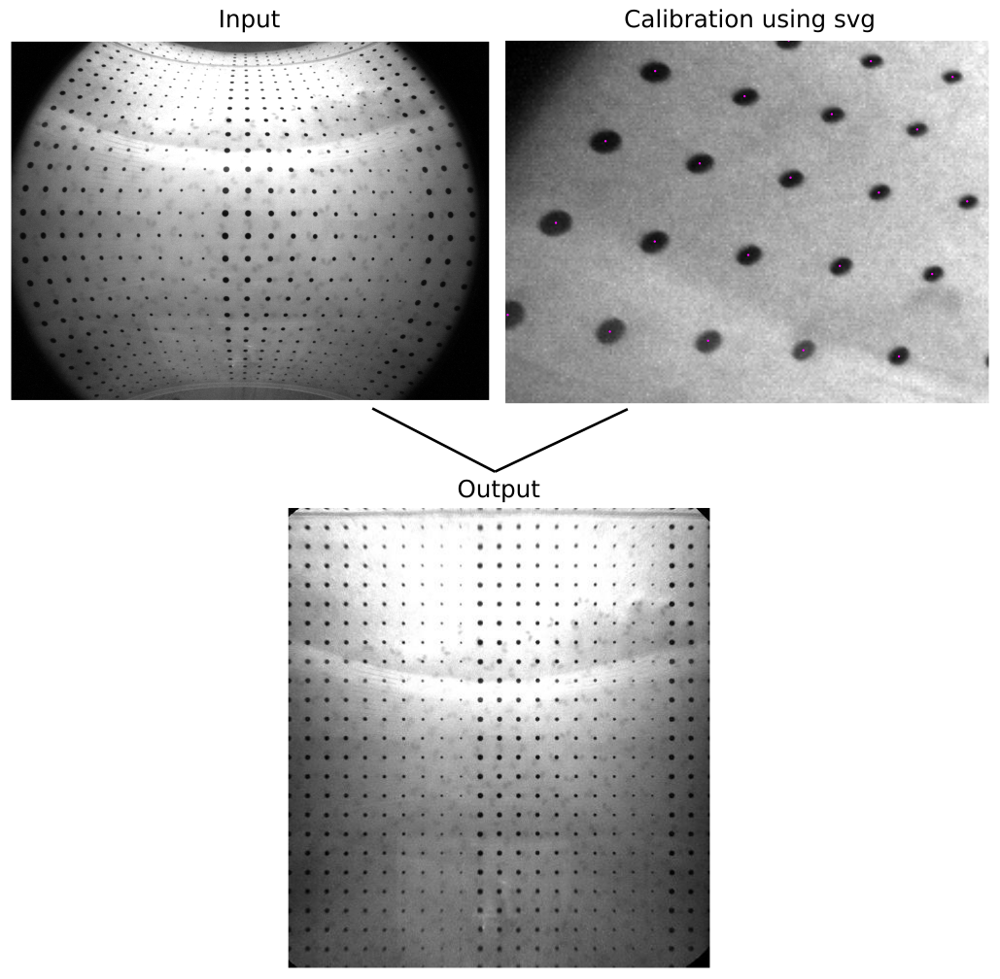

# Grid unwarp #
Software to unwarp images based on a grid calibration image. The calibration can be done by providing a svg file made with a vector program (Inkscape for example) with dots on the grid intersection points.



## Usage ##
There are two tools: `test_grid.py` and `unwarp_batch.py`. 

* `unwarp_batch.py` lets you unwarp one or many images based on the same calibration data. See `unwarp_batch.py --help`


```
usage: unwarp_batch.py [-h] [--destination-folder DESTINATION_FOLDER] [--output-format OUTPUT_FORMAT] [--processes PROCESSES] calibration_svg grid_size_x grid_size_y output_pixels_per_grid_unit input_files [input_files ...]

positional arguments:
  calibration_svg
  grid_size_x
  grid_size_y
  output_pixels_per_grid_unit
  input_files

optional arguments:
  -h, --help            show this help message and exit
  --destination-folder DESTINATION_FOLDER
                        If set, original filenames are used. Else the files are stored in the current directory with the prefix "unwarped" (default: None)
  --output-format OUTPUT_FORMAT
                        jpg, png, tiff, etc ... Can be any format supported by imageio (default: png)
  --processes PROCESSES
                        Number of simultaneous processes. Default equals amount of CPU cores (default: -1)
```

* `test_grid.py` lets you generate a  test image to check if the grid is detected correctly (the continous lines) and if the interpolation works (shown by the red crosses). To check the usage see `test_grid.py --help`

## Examples ##
- run `python test_grid.py -b example.png example.svg 23 25` to show a test image applied to the example image
- run `python unwarp_batch.py --output-format=jpg example.svg 23 25 20 example.png`


## Creating calibration images ##
- The objects at the intersections should be circles
- All the circles should have color magenta (`#FF00FF`) except for the special types
- The upper left corner is marked by a green dot (`#00FF00`)
- The second dot on the first row should be red (`#FF0000`)
- The second dot on the first column should be blue (`#0000FF`)
- The grid should be rectangular
- The units of the file should be in pixels
- The svg file should have the same dimensions as the to be processed images
- Check the grid by running `test_grid.py`


## Requirements
- Python 3.7 or higher
- The following pip packages:
  - numpy
  - imageio
  - scipy
  - matplotlib (for `test_grid.py`)
  - more-itertools
  - Execution-Time
